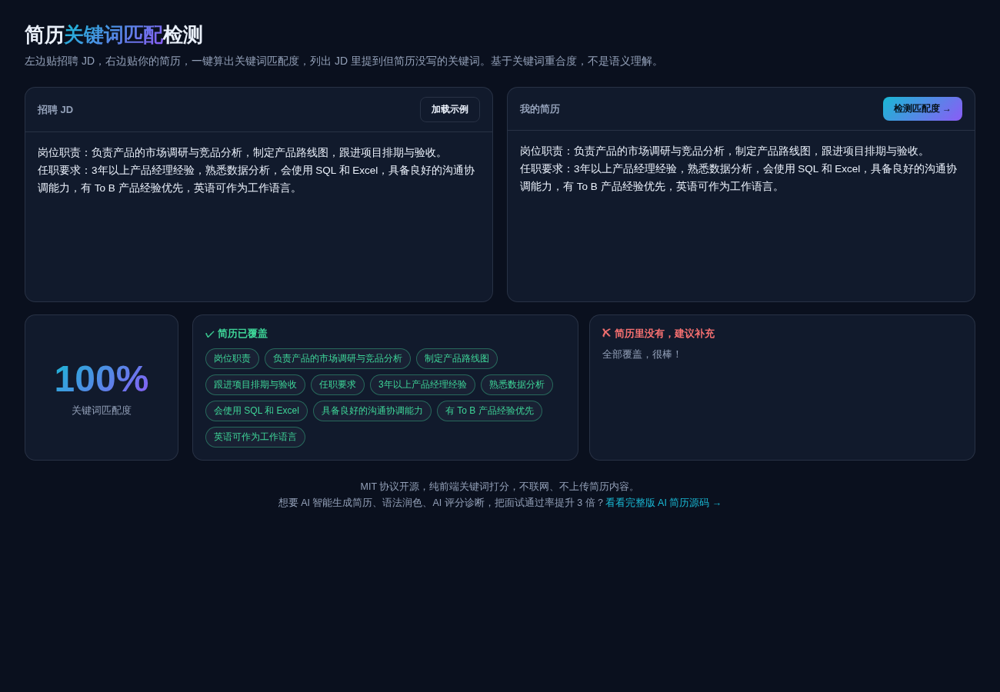

# Resume Match

**[Live demo →](https://anna123123123-creator.github.io/resume-match/)**

A free, open-source resume-to-job-description keyword matcher that runs entirely in the browser. Paste the job posting on one side and your resume on the other: it scores the match and lists what the posting asks for that your resume never mentions. Keyword overlap only — nothing is uploaded, nothing is stored.



## Run it

Open `index.html` in a browser, or serve the folder:

```bash
python3 -m http.server 8000
```

## How it works

The job description is split on punctuation into individual requirement fragments. Each fragment and the resume are tokenised (English words, plus bigrams for Chinese), and the tool measures what share of a fragment's keywords also appear in the resume. Above 50% overlap the fragment counts as covered; below that it goes into the "worth adding" list. The final score is covered fragments divided by total fragments.

This is keyword overlap, not semantic understanding. If your resume says the same thing in completely different words — the posting asks for "cross-functional collaboration" and your resume says "led a team" — it will not connect the two. It is a string-matching tool and it does not pretend to be anything else.

## License

MIT.
